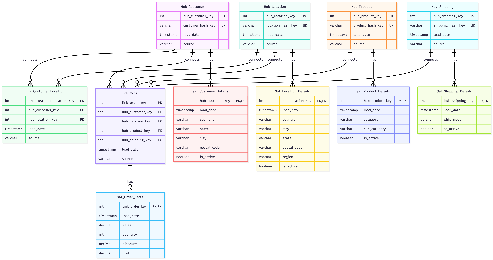
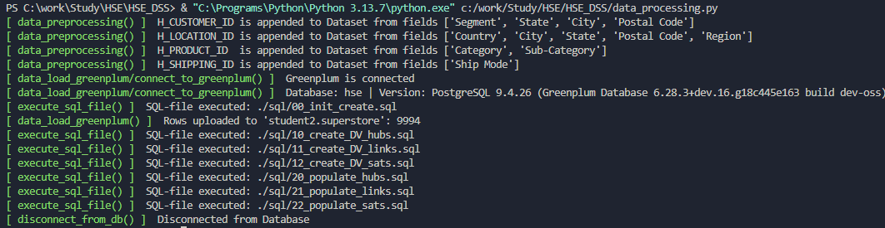
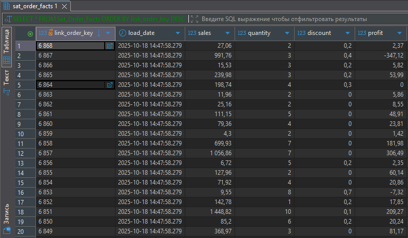

## Логика
1. Предподготовка данных - генерация бизнес-ключей для обозначенных хабов
2. Загрузка данных в БД
   1. Создание схемы в БД -						[00_init_create.sql		](./sql/00_init_create.sql)
   2. Перенос данных superstore из csv в БД -	[copy_data_from_csv()	](./data_processing.py)
   3. Создание таблиц Хабов -					[10_create_DV_hubs.sql	](./sql/10_create_DV_hubs.sql)
   4. Создание таблиц Ссылок -					[11_create_DV_links.sql	](./sql/11_create_DV_links.sql)
   5. Создание таблиц Спутников -				[12_create_DV_sats.sql	](./sql/12_create_DV_sats.sql)
   6. Заполнение таблиц Хабов данными -			[20_populate_hubs.sql	](./sql/20_populate_hubs.sql)
   7. Заполнение таблиц Ссылок данными -		[21_populate_links.sql	](./sql/21_populate_links.sql)
   8. Заполнение таблиц Спутников данными -		[22_populate_sats.sql	](./sql/22_populate_sats.sql)

## Структура

### Хабы
| Имя | Значение | Поля |
| --- | --- | --- |
| H_CUSTOMER	| клиент			| Segment |
| H_PRODUCT		| товар 			| Category, Sub-Category |
| H_GEOGRAPHY	| география			| Country, City, State, Region, Postal Code |
| H_SHIPPING	| способ доставки	| Ship Mode |

### Ссылки
| Имя | Значение |
| --- | --- |
| L_ORDER_PRODUCT	| связывает заказ и товар |
| L_ORDER_CUSTOMER	| связывает заказ и клиента |
| L_ORDER_GEOGRAPHY	| связывает заказ и географию |
| L_ORDER_SHIPPING	| связывает заказ и способ доставки |

### Спутники
| Имя | Поля |
| --- | --- |
| S_CUSTOMER_DETAILS	| Segment |
| S_PRODUCT_DETAILS		| Category, Sub-Category |
| S_GEOGRAPHY_DETAILS	| Country, City, State, Region, Postal Code |
| S_SHIPPING_DETAILS	| Ship Mode |
| S_ORDER_FACTS			| Sales, Quantity, Discount, Profit |

## Результат

