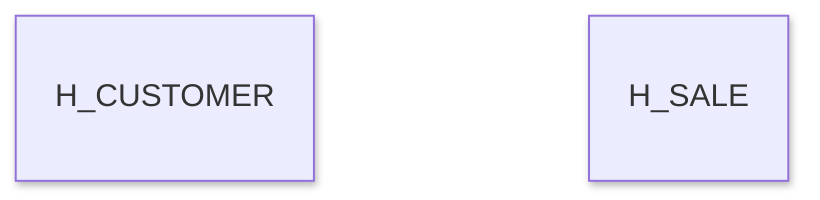

### Хабы
| Имя | Значение | Поля |
| --- | --- | --- |
| H_CUSTOMER | клиент | Segment |
| H_PRODUCT | товар | Category, Sub-Category |
| H_GEOGRAPHY | география | Country, City, State, Region, Postal Code |
| H_SHIPPING | способ доставки | Ship Mode |

### Ссылки
| Имя | Значение |
| --- | --- |
| L_ORDER_PRODUCT | связывает заказ и товар |
| L_ORDER_CUSTOMER | связывает заказ и клиента |
| L_ORDER_GEOGRAPHY | связывает заказ и географию |
| L_ORDER_SHIPPING | связывает заказ и способ доставки |

### Спутники
| Имя | Поля |
| --- | --- |
| S_CUSTOMER_DETAILS | Segment |
| S_PRODUCT_DETAILS | Category, Sub-Category |
| S_GEOGRAPHY_DETAILS | Country, City, State, Region, Postal Code |
| S_SHIPPING_DETAILS | Ship Mode |
| S_ORDER_FACTS | Sales, Quantity, Discount, Profit |

### Структура

